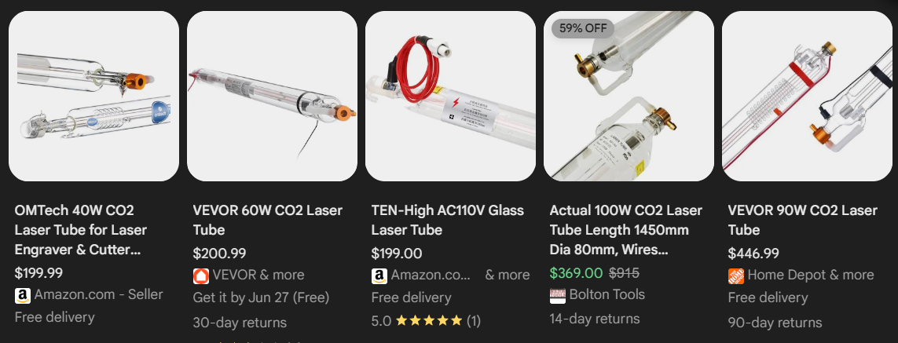
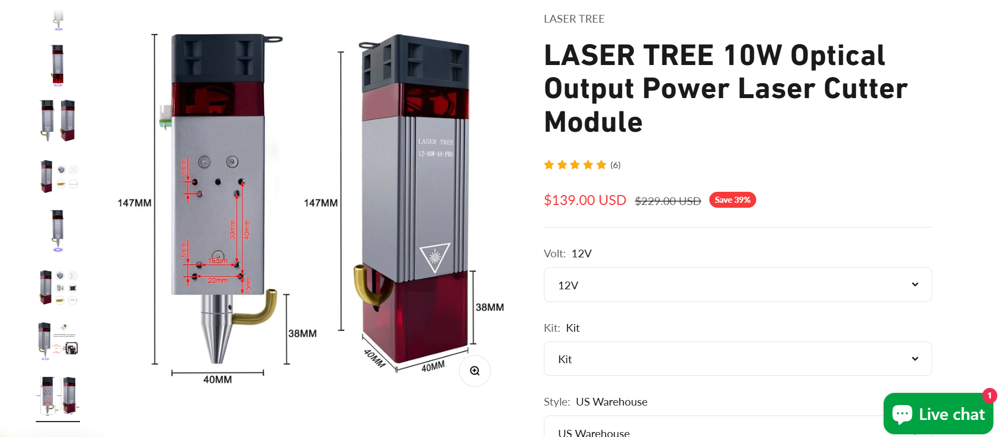
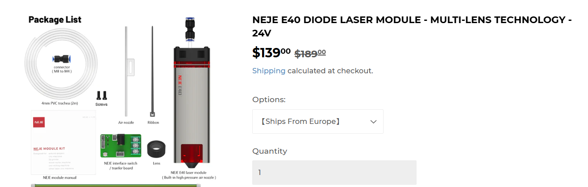
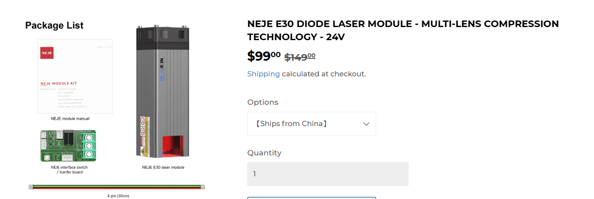
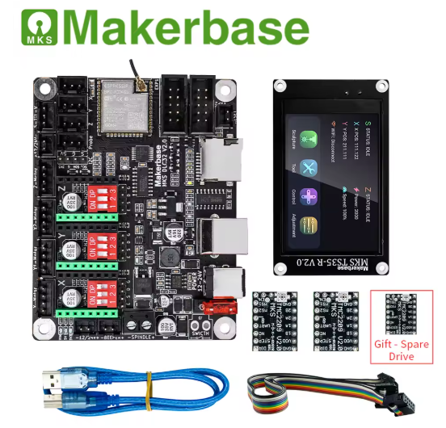
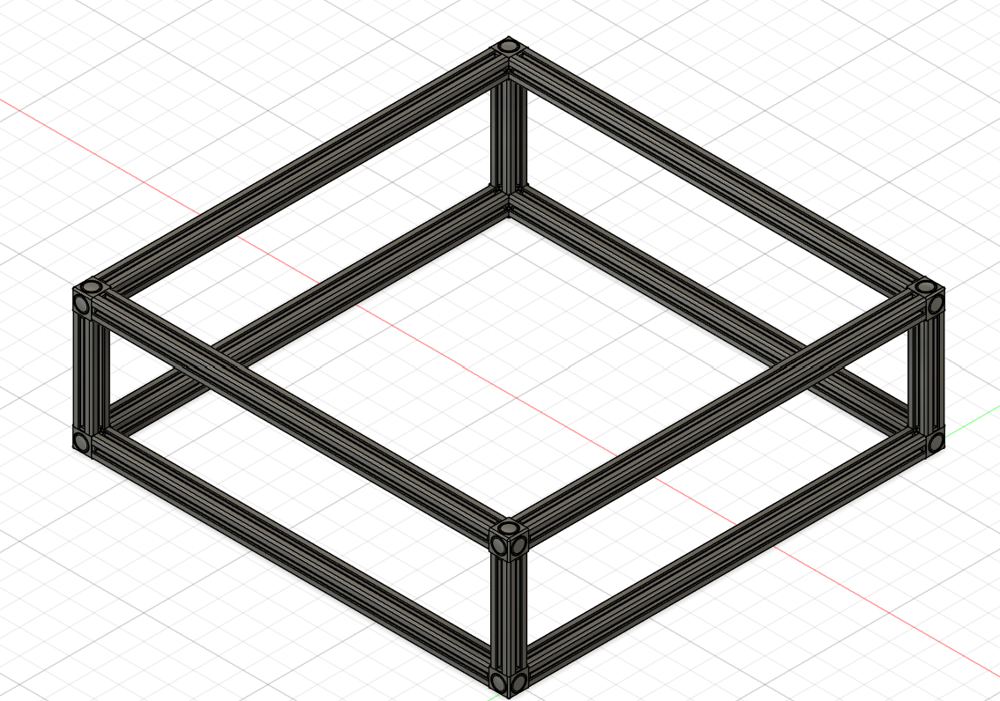

# Ember
A Custom Built 10w Laser Cutter

---
title: "Ember"
author: "DynamicWhiteHat"
description: "A custom-built $350 10w laser cutter."
created_at: "2025-06-13"
---

# June 13th: Selected parts and started CAD

I first started off by selecting the laser for my laser cutter. Since I don't have any experience with building or even usign laser cutters, I decided to watch a few videos on the topic. [This](https://www.youtube.com/watch?v=7gnD6F0yBH0&list=PLT2B-jiRa_P4blv69gIPtibwSavtNRHN4&index=2) video was particularly useful in helping me understand the topic.

### Choosing the laser

Initially, I had decided to build a CO2 laser like the one in the video, as it is powerful and not too hard to build. However, after looking at the prices for just the CO2 laser tube, I decided to switch to a cheaper and less powerful diode laser. Most CO2 lasers were costing around $200. At this price point, it would be hard for me to get other parts such as the MCU and the steppers while fitting in the motion system.

I decided to switch to buying a 10W diode laser, which is cheaper yet can still cut through many things. Additionally, switching to this cheaper alternative allowed me to fit some additional items in my budget, such as a screen for the MCU. I no longer have to buy mirrors to reflect the CO2 lasers. I narrowed down my selection to these three lasers:

-------------------------------------------------------------------------------------------------------------------
| LaserTree 10W LT-80W-AA-PRO $139    | NEJE E40 $139                       | NEJE E30 $99                        |
|-------------------------------------|-------------------------------------|-------------------------------------|
|  |  |  |
-------------------------------------------------------------------------------------------------------------------

After comparing the three, I chose the [LaserTree 10W laser](https://lasertree.com/products/10w-optical-output-power-laser-cutter-module?variant=42608494149783) due to poor reviews of NEJE products that I found online. It also includes some additonal items at the same price point as the NEJE E40. My total cost is now $139.

### Choosing the power supply

I needed to pick a reliable and powerful PSU to make sure that the cutter was getting enough power. I looked online for some recommended ones and settled on [this](https://www.digikey.com/en/products/detail/mean-well-usa-inc/LRS-350-24/7705034) 24v 350W PSU from Mean Well for $32. This brings my total cost up to $171.

### Choosing the MCU

Once again I searched online for some commonly used MCU units. I could either use an Arduino with the CNC shield, which, although it simple to use, doesn't provide many additional features such as wireless connectivity or a display adapter. I also found the MCUs from MakerBase. Their MKS DLC32 caught my eye since it featured an ESP32 allowing wireless connectivity and had the option for a display. I also own a 3D printer that uses a MakerBase MCU, so I have some experience with using their products. I decided to settle on [this](https://www.aliexpress.us/item/3256802997183501.html?spm=a2g0o.store_pc_home.productList_8356958.pic_0&gatewayAdapt=glo2usa4itemAdapt#nav-review) product from the official MakerBase seller on AliExpress. The price for this product is $68, bringing the total price up to $239. The bundle with the display also came with 3 TMC2209 stepper drivers, which meant that I didn't have to buy them separately. 

### Choosing the steppers

I have looked into stepper motors before for other projects, so I knew that a good set of quality and powerful stepper motors would be the Nema17 steppers. These motors are widely used in many DIY and commercial products. I found [this](https://www.amazon.com/STEPPERONLINE-Stepper-Bipolar-Connector-compatible/dp/B00PNEQKC0/ref=sr_1_3?dib=eyJ2IjoiMSJ9.hN-9QQUUabt-Xybqh_2heY2GPNfYHPQMKSJH70tSBpKPaeHg8VsfoBM8I8VbHdZx5oajdgUK1JpCg-V2kdytfI2UCH8U6rhdwWgO99yrqNCP1uZWEM0ySZZtHlBZkGRE3OAXyVSeMe4EK2Liixq1llyKdgNVWiDEbp5acAd7aFDVpl3ZC_olS7wdxDTBBxwvn-TwtY7MKyuGCykD-4Jg5KCgi6iDggAy-vSSnx8GSbk.pCD136yaYWmr_IUa_hgxzZegYZ58EWgrNOGNo-PW7lU&dib_tag=se&keywords=nema+17&qid=1749845438&sr=8-3#averageCustomerReviewsAnchor) Amazon listing for $13, and I needed two of them, so the price for the steppers was $26, bringing the total price up to $265.

### Additional parts

Now that I have the main parts selected out, I decided to look into a few additional parts that add to ease of use. First, I picked out some mechanical endstop switches to make zeroing a breeze. I found [this](https://www.amazon.com/REIFENG-Mechanical-Endstop-Horizontal-Ramps1-4/dp/B07PCN6T6F/ref=sr_1_4?crid=2NOPIC2BME68G&dib=eyJ2IjoiMSJ9.SO49a-XNmdH1AGulMpypJVjJ2qnjUKBfcRAxacJJ614mILy1HfdP7rmEqK9IchS60nDjmEtk-YDwAOqgRqTMUm9DpFCzqNhBdYW0i6Y4EXgvAXUQUOWgTSdXNVq0DTvVpi24VGGgNUSGy3fAjR6N38FKI9jrl9Q_bFgIKd-Dsq2qHoIFdd6l777VM45a1CngxLLnEAC0diHWbTa2n4FxJo3B8TSm0BR5ddn4uK1aIJbe3bgYpcaEA6JcyaQ9iljZW_ZnoXordtg4Dyu8nMkTS9H4DC1n7YeqJA2eYbFVE0A.qGr0r3Wi12V7IGiNbizVL-U-n8TNoubLwQRm1zHLt2k&dib_tag=se&keywords=mechanical+limit+switches&qid=1749845648&s=industrial&sprefix=mechanical+limit+switches%2Cindustrial%2C78&sr=1-4) 6 pack on Amazon for $11. I also settled on [this](https://www.amazon.com/APIELE-Momentary-Button-Mushroom-Waterproof/dp/B09KZJ2LF6?source=ps-sl-shoppingads-lpcontext&ref_=fplfs&gQT=1&th=1) 16mm button for emergency stopping for $8. Finally, I picked out a $36 [aluminum honeycomb bed](https://www.amazon.com/UniTak3D-Honeycomb-400x400mm-Dissipation-Protection/dp/B0DHH5XBNH/ref=sr_1_4?crid=21ZGMEMX3VNZS&dib=eyJ2IjoiMSJ9.8uQQoWfW5Evq2OHyK5QqiDAZdn3N3lJeWpBOZYqQIQDySlLXF2xWyHMZmFLRs7aFo7TPTw8XaI2HXFWu0QPhKd3bamxoIP0JpC4qxKgroqEtH82Y-wXj-GZP6FdBi_IHVFIdsBd4q8mtw2UjD3yV0mLFWYlh8ofpTyx1RzEz2xRwboEpzAptT2ErQgQveawKRZXmJOm3bKmimEfr7j6McMrDnrEcQ1CrH3tBlvFCVyAbroqrnltL2-cvbY1JIXs7sODZ_jUd975pJ77z0gRkJeFSYBT3rsapmxbDlbOxtNI.jIYikubNSzroelbeFV7IPZywZyud3g1UaNZ9QS7q9r4&dib_tag=se&keywords=laser%2Bbed&qid=1749863252&s=industrial&sprefix=laser%2B%2Cindustrial%2C221&sr=1-4&th=1#averageCustomerReviewsAnchor) for the laser cutter to cut on. The total for additonal parts is $55, bringing the total to $320.

### CAD

I started doing the CAD and decided to make an enclosed cutting system to prevent eye damage. I started the CAD by importing a few 2020 aluminum T extrusions from McMasterCarr into Fusion and built a box. This was my first time using joints and it was great to see everything fit together perfectly without me having to meticulously move things into position. At the end of this session, I ended up with this outline:

I might have to cut the cost on some parts to be able to fit this design into the $350 budget.

### Total time spent: 5 hours

# June 15th: CAD

I decided to restart my CAD since doing a fully enclosed cutter would most likely exceed the $350 budget. Instead, I opted to do an open design, especially after I sa that the laser module has a laser filter around the beam itself, so it should be safe to run without an enclosure. I found [this](https://www.youtube.com/watch?v=NyUJvcocJpA&t=475s&pp=ygUQZGl5IGxhc2VyIGN1dHRlcg%3D%3D) video online which gave me a good idea on how to start this design. I first created the frame for everything using 2020 aluminum extrusions and closed gusset corner brackets for stability and added some feet.

After that, I tried to create the y-axis, but I just couldn't figure out how to design it. I understood how the mechanics of it worked, but I didn't know where to begin designing it. After looking at some other 3D printed designs online, I found [this](https://www.thingiverse.com/thing:3567976/files) design, which was very helpful. It also had a PDF for how to build it, which allowed me to understand how parts fit each other. After I found this design, I started updating my own design and ended up with this for the y-axis:

Designing this took a while since I forgot to account for the height of the stepper motor, which made me redesign the 8mm rod holders once I started the steppers. This was also my first time using joints to create motion, and I used this to make rotating GT2 belt pulleys.

Finally, I started on the x-axis. The first YouTube video I found placed their rods on the same horizontal axis, which made the overall design shorter. The 2nd design I found had them placed vertically, which made it taller. However, because of the 2nd design's taller x-axis, there was more surface area to attach the laser itself, giving it better stability, so I decided to go with this design. This is my x-axis, which I have to finish.

### Total time spent: 10 hours

# June 16th: Finished CAD

I spent most of the day working on the CAD model. The first thing I did was finish the x-axis. I had to add the stepper motor onto one end of the axis, which made the holder for it very large. One issue I ran into while designing this portion was that there were no M3 screws greater than 20mm available for cheap online to fasten the motor onto the 3D printed part. The workaround I came up with was a magnetic plate that went over top of the screws to hide an indent I made so I could fit shorter screws. That ended up looking like this:

| Plate Off | Plate On |
|-----------|----------|
|  |  |

After that bit, I worked on adding in the GT2 pulley and the idler pulley on the x-axis ends. The right side had the motor on it, so that side had the pulley. The left side of the axis had the idler pulley added to it. Once this was complete, my axis looked like this:

The next thing I had to add was the mount for the laser diode itself. I was able to find a 3D model of the laser on [Thingiverse](https://www.thingiverse.com/thing:6265918/files). I found this model especially interesting since the designer was able to model the laser while preserving many of its details in Tinkercad. I was confused about how the laser head would attach to the axis, but I found an amazon listing for a part that comes with the laser and that cleared everything up. I mounted the laser near the top half of the center, which ended up looking like this:

|  |  |
|-------------------------------------------------------------------------------------------|-------------------------------------------------------------------------------------------|

The only part left to model was the main control board (DLC32) and the touchscreen for it. I imported some 3D models I found on GrabCAD and projected their edges with an offset of 0.2. This let me quickly extrude out a box for the board and screen. I left the back for the board open to allow wires to come through. Once I was done with those two, I added spots for the endstops. This was a bit difficult since I was not able to find an exact 3D model online and the listing had very little information on measurements. I edited a similar model I found and used it to make cavities to put them in. This is my final design:

The only thing left to do is source the parts and find cheaper alternatives for other parts since I know I will go over budget. If I need to reduce a lot of money, I can switch to the $99 laser head, which would give me $50 more to work with.

### Total time spent: 8 hours

## Final Design Addition 6/17/25

I was working on making sure everything fit under $350, and I decided to change to the NEJE E40 instead of the LaserTree since NEJE offers free shipping compared to LaserTree's $35. This required a redesign of the x-axis holder for the laser, which now looks like this:

I also realized while looking for 2020 extrusions that the model I was using in Fusion had smooth inside edges whereas the actual ones had sharp edges. This once again required a redesign of the components that required a tight fit instead of screws to stay in place.

Now that I've finished all that and selected the parts, I think the design of this project is finally complete!

### Time spent: 2 hours

