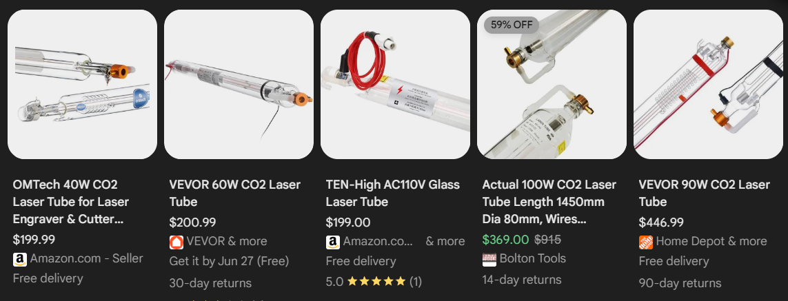
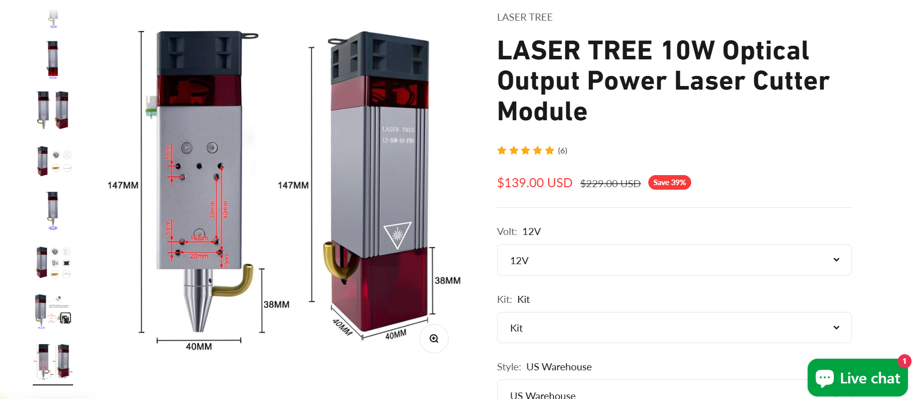
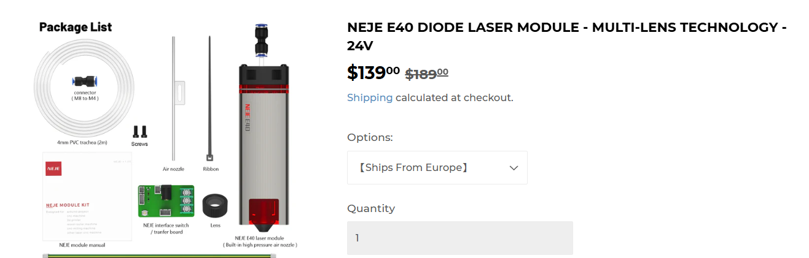
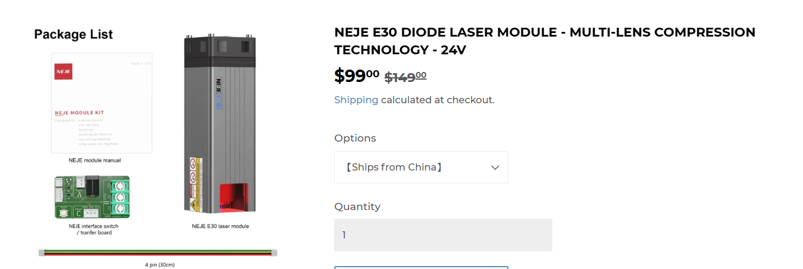
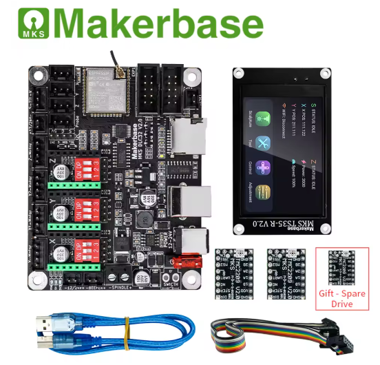

# Ember
A Custom Built 10w Laser Cutter

---
title: "Ember"
author: "DynamicWhiteHat"
description: "A custom-built $350 10w laser cutter."
created_at: "2025-06-13"
---

# June 13th: Selected parts and started CAD

I first started off by selecting the laser for my laser cutter. Since I don't have any experience with building or even usign laser cutters, I decided to watch a few videos on the topic. [This](https://www.youtube.com/watch?v=7gnD6F0yBH0&list=PLT2B-jiRa_P4blv69gIPtibwSavtNRHN4&index=2) video was particularly useful in helping me understand the topic.

### Choosing the laser

Initially, I had decided to build a CO2 laser like the one in the video, as it is powerful and not too hard to build. However, after looking at the prices for just the CO2 laser tube, I decided to switch to a cheaper and less powerful diode laser. Most CO2 lasers were costing around $200. At this price point, it would be hard for me to get other parts such as the MCU and the steppers while fitting in the motion system.

I decided to switch to buying a 10W diode laser, which is cheaper yet can still cut through many things. Additionally, switching to this cheaper alternative allowed me to fit some additional items in my budget, such as a screen for the MCU. I no longer have to buy mirrors to reflect the CO2 lasers. I narrowed down my selection to these three lasers:

-------------------------------------------------------------------------------------------------------------------
| LaserTree 10W LT-80W-AA-PRO $139    | NEJE E40 $139                       | NEJE E30 $99                        |
|-------------------------------------|-------------------------------------|-------------------------------------|
|  |  |  |
-------------------------------------------------------------------------------------------------------------------

After comparing the three, I chose the [LaserTree 10W laser](https://lasertree.com/products/10w-optical-output-power-laser-cutter-module?variant=42608494149783) due to poor reviews of NEJE products that I found online. It also includes some additonal items at the same price point as the NEJE E40. My total cost is now $139.

### Choosing the power supply

I needed to pick a reliable and powerful PSU to make sure that the cutter was getting enough power. I looked online for some recommended ones and settled on [this](https://www.digikey.com/en/products/detail/mean-well-usa-inc/LRS-350-24/7705034) 24v 350W PSU from Mean Well for $32. This brings my total cost up to $171.

### Choosing the MCU

Once again I searched online for some commonly used MCU units. I could either use an Arduino with the CNC shield, which, although it simple to use, doesn't provide many additional features such as wireless connectivity or a display adapter. I also found the MCUs from MakerBase. Their MKS DLC32 caught my eye since it featured an ESP32 allowing wireless connectivity and had the option for a display. I also own a 3D printer that uses a MakerBase MCU, so I have some experience with using their products. I decided to settle on [this](https://www.aliexpress.us/item/3256802997183501.html?spm=a2g0o.store_pc_home.productList_8356958.pic_0&gatewayAdapt=glo2usa4itemAdapt#nav-review) product from the official MakerBase seller on AliExpress. The price for this product is $68, bringing the total price up to $239. The bundle with the display also came with 3 TMC2209 stepper drivers, which meant that I didn't have to buy them separately. 

### Choosing the steppers

I have looked into stepper motors before for other projects, so I knew that a good set of quality and powerful stepper motors would be the Nema17 steppers. These motors are widely used in many DIY and commercial products. I found [this](https://www.amazon.com/STEPPERONLINE-Stepper-Bipolar-Connector-compatible/dp/B00PNEQKC0/ref=sr_1_3?dib=eyJ2IjoiMSJ9.hN-9QQUUabt-Xybqh_2heY2GPNfYHPQMKSJH70tSBpKPaeHg8VsfoBM8I8VbHdZx5oajdgUK1JpCg-V2kdytfI2UCH8U6rhdwWgO99yrqNCP1uZWEM0ySZZtHlBZkGRE3OAXyVSeMe4EK2Liixq1llyKdgNVWiDEbp5acAd7aFDVpl3ZC_olS7wdxDTBBxwvn-TwtY7MKyuGCykD-4Jg5KCgi6iDggAy-vSSnx8GSbk.pCD136yaYWmr_IUa_hgxzZegYZ58EWgrNOGNo-PW7lU&dib_tag=se&keywords=nema+17&qid=1749845438&sr=8-3#averageCustomerReviewsAnchor) Amazon listing for $13, and I needed two of them, so the price for the steppers was $26, bringing the total price up to $265.

### Additional parts

Now that I have the main parts selected out, I decided to look into a few additional parts that add to ease of use. First, I picked out some mechanical endstop switches to make zeroing a breeze. I found [this](https://www.amazon.com/REIFENG-Mechanical-Endstop-Horizontal-Ramps1-4/dp/B07PCN6T6F/ref=sr_1_4?crid=2NOPIC2BME68G&dib=eyJ2IjoiMSJ9.SO49a-XNmdH1AGulMpypJVjJ2qnjUKBfcRAxacJJ614mILy1HfdP7rmEqK9IchS60nDjmEtk-YDwAOqgRqTMUm9DpFCzqNhBdYW0i6Y4EXgvAXUQUOWgTSdXNVq0DTvVpi24VGGgNUSGy3fAjR6N38FKI9jrl9Q_bFgIKd-Dsq2qHoIFdd6l777VM45a1CngxLLnEAC0diHWbTa2n4FxJo3B8TSm0BR5ddn4uK1aIJbe3bgYpcaEA6JcyaQ9iljZW_ZnoXordtg4Dyu8nMkTS9H4DC1n7YeqJA2eYbFVE0A.qGr0r3Wi12V7IGiNbizVL-U-n8TNoubLwQRm1zHLt2k&dib_tag=se&keywords=mechanical+limit+switches&qid=1749845648&s=industrial&sprefix=mechanical+limit+switches%2Cindustrial%2C78&sr=1-4) 6 pack on Amazon for $11. I also settled on [this](https://www.amazon.com/APIELE-Momentary-Button-Mushroom-Waterproof/dp/B09KZJ2LF6?source=ps-sl-shoppingads-lpcontext&ref_=fplfs&gQT=1&th=1) 16mm button for emergency stopping for $8. Finally, I picked out a $36 [aluminum honeycomb bed](https://www.amazon.com/UniTak3D-Honeycomb-400x400mm-Dissipation-Protection/dp/B0DHH5XBNH/ref=sr_1_4?crid=21ZGMEMX3VNZS&dib=eyJ2IjoiMSJ9.8uQQoWfW5Evq2OHyK5QqiDAZdn3N3lJeWpBOZYqQIQDySlLXF2xWyHMZmFLRs7aFo7TPTw8XaI2HXFWu0QPhKd3bamxoIP0JpC4qxKgroqEtH82Y-wXj-GZP6FdBi_IHVFIdsBd4q8mtw2UjD3yV0mLFWYlh8ofpTyx1RzEz2xRwboEpzAptT2ErQgQveawKRZXmJOm3bKmimEfr7j6McMrDnrEcQ1CrH3tBlvFCVyAbroqrnltL2-cvbY1JIXs7sODZ_jUd975pJ77z0gRkJeFSYBT3rsapmxbDlbOxtNI.jIYikubNSzroelbeFV7IPZywZyud3g1UaNZ9QS7q9r4&dib_tag=se&keywords=laser%2Bbed&qid=1749863252&s=industrial&sprefix=laser%2B%2Cindustrial%2C221&sr=1-4&th=1#averageCustomerReviewsAnchor) for the laser cutter to cut on. The total for additonal parts is $55, bringing the total to $320.

### CAD

I started doing the CAD and decided to make an enclosed cutting system to prevent eye damage. I started the cad by importing a few 2020 aluminum T extrusions from McMasterCarr into Fusion and built a box. This was my first time using joints and it was great to see everything fit together perfectly without me having to meticulously move things into position. At the end of this session, I ended up with this outline:

I might have to cut the cost on some parts to be able to fit this design into the $350 budget.

### Total time spent: 5 hours